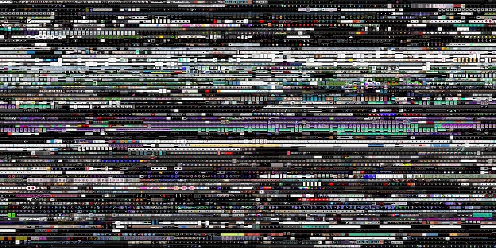

# Screenshot Viz



Scans given folder, creates 256x256 thumbnails in a cache folder and merges them into 4096x4096 mosaic with 32x32 pixels sized thumbnails. That limits max number of files you can fit to 16'000.

## Why?

You can achieve simlar effect with [ImageMagick](http://imagemagick.org/Usage/montage/) by running the command below but for 10k+ images I was running out of RAM.

```
montage **/*.png -monitor -geometry 32x32+0+0 out.jpg
```

## Installation

This script requires [ImageMagick](http://www.imagemagick.org/script/download.php) to be installed on your machine. Then you can clone this repo:

```
git clone https://github.com/vorg/screenshot-viz
cd screenshot-viz
npm install
```

## Usage

```bash
# all pngs inside folder and subfolders
node index.js "/absolute/path/to/root/folder/**/*.png"

# just jpegs inside given folder
node index.js "/absolute/path/to/root/folder/*.jpg"
```

## Notes

I haven't tested it outside of OSX.
